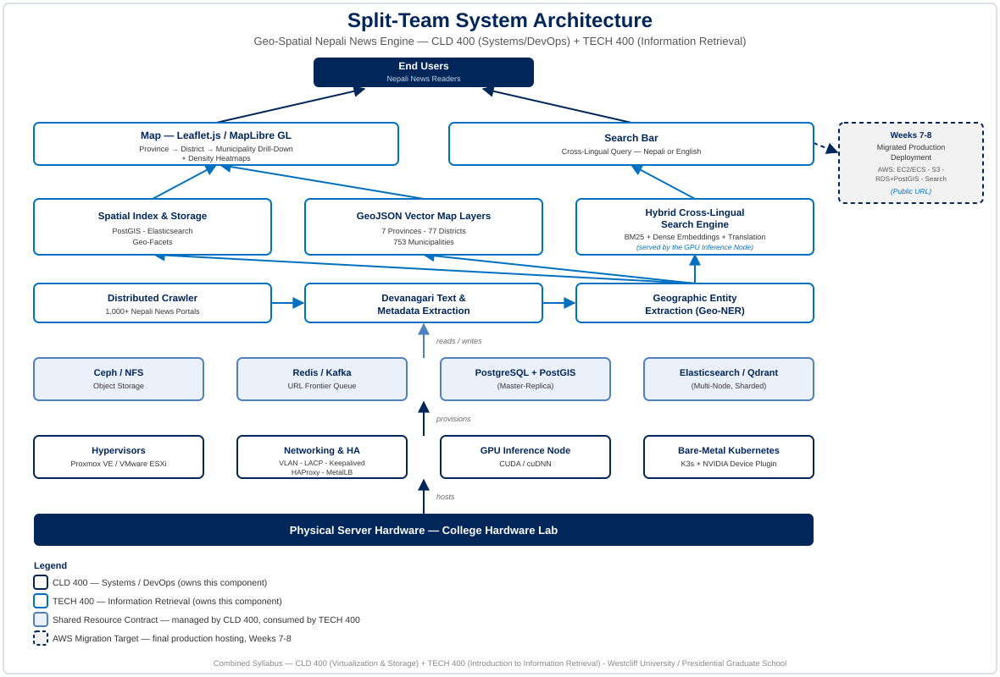

# PGS Search Engine

A real-time, geographically aware, cross-lingual (Nepali + English) search engine that indexes the Nepali web at large — not just news. It aims to crawl and index all publicly available websites of Nepal: news portals, all levels of government (federal/provincial ministries and departments down to local government and municipality sites), government corporations and institutions, universities and academic institutions, major corporations (banks, companies, cooperatives), and `.np`-domain sites generally. An NLP/geo-tagging pipeline resolves each page to a province/district/municipality where applicable, and a hybrid lexical + neural search index serves results through both a search bar and an interactive map of Nepal.



## What it does

- **Crawls** the Nepali web at scale — news portals, central/provincial/local government sites, government corporations and institutions, universities, banks and corporations, and other `.np`/Nepal-based websites (distributed crawler fleet, URL frontier queue, dedup).
- **Extracts** Devanagari (and English) text and metadata from raw HTML across these varied site types.
- **Geo-tags** content to a municipality/district/province using a Devanagari administrative gazetteer and NER-based disambiguation, where the content has a geographic association.
- **Indexes** content with a hybrid ranking pipeline: Okapi BM25 (lexical) fused with dense multilingual embeddings (neural), so a query in Nepali or English returns correctly ranked results (English queries are auto-translated before retrieval).
- **Serves** results two ways: a search bar (`/api/v1/search`) and a province → district → municipality drill-down map with content-density heatmaps (`/api/v1/news`).

## Project layout

| Directory | Purpose |
| --- | --- |
| [`ui/`](ui/) | Next.js frontend — search bar and interactive Nepal map (Leaflet/MapLibre). |
| [`api/`](api/) | FastAPI backend serving search and geo-filtered content APIs. |
| [`database/`](database/) | `pgs-db` — a standalone, installable Python package (SQLAlchemy models + Pydantic schemas) shared across backend services. Framework-independent, not tied to FastAPI. |
| [`scraper/`](scraper/) | Go-based distributed crawler for Nepali websites (news, government, education, corporate, and other `.np`/Nepal-based sites). |
| [`ETL/`](ETL/) | Extraction/transform pipelines (text cleaning, geo-tagging, embedding generation) feeding the search index. |
| [`search-engine/`](search-engine/) | Search/ranking index configuration (Elasticsearch/Qdrant) and hybrid BM25 + dense-embedding scoring. |
| [`terraform/`](terraform/) | Infrastructure as code for provisioning (bare-metal and cloud). |
| [`k8/`](k8/) | Kubernetes manifests for container orchestration. |

## Getting started

Each service has its own setup docs in its directory. Quick summary:

- **UI**: `cd ui && npm install && npm run dev`
- **API**: `source .venv/bin/activate && uvicorn api.main:app --app-dir . --reload` (root-level `.venv`; see below)
- **Database package**: `pip install -e ./database` — installs `pgs-db`, importable from any Python project (`import pgs_db`)
- **Scraper**: `cd scraper && go run ./cmd/scraper`

### Python environment

A single virtual environment at the repo root (`.venv/`) is shared by the API and any other Python tooling. It has the `pgs-db` package installed in editable mode plus FastAPI/Uvicorn:

```bash
python3 -m venv .venv
source .venv/bin/activate
pip install -e ./database
pip install fastapi "uvicorn[standard]"
```

### Linting, formatting & type checking

Python code (`api/`, `database/src/`) is kept strictly typed and consistently formatted using [Ruff](https://docs.astral.sh/ruff/) (linting + formatting, replacing Black/Flake8/isort) and [Pyright](https://microsoft.github.io/pyright/) (strict mode). Config lives in the root [`pyproject.toml`](pyproject.toml).

```bash
source .venv/bin/activate
pip install ruff pyright

ruff format .          # format
ruff check . --fix     # lint
pyright                # strict type check
```

## Scope of crawling

The crawl targets are not limited to news. The intent is to cover all publicly reachable Nepali websites, including:

- News portals (national and local)
- Government: federal ministries/departments, provincial governments, and local governments (municipalities/wards)
- Government corporations, institutions, and cooperatives
- Universities and other educational/academic institutions
- Major corporations: banks, companies, and other private-sector organizations
- General `.np`-domain and other Nepal-based websites not covered above

## Background

This project originates from a combined systems/DevOps + information-retrieval capstone: one team builds the bare-metal infrastructure (virtualization, distributed storage, queues, Kubernetes), and another builds the crawler, NLP, geo-spatial, and search stack on top of it — the split reflected in this repo's directory structure.
