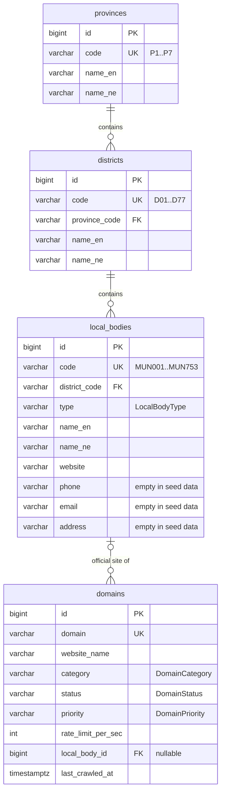
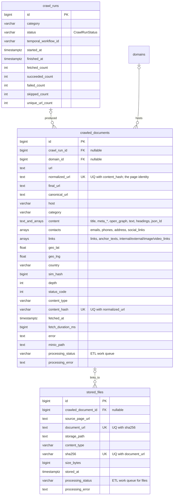
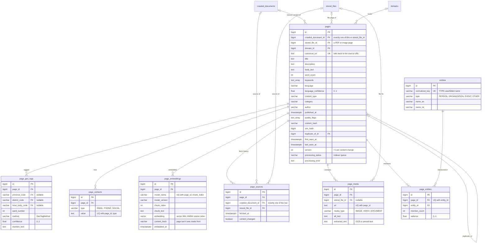
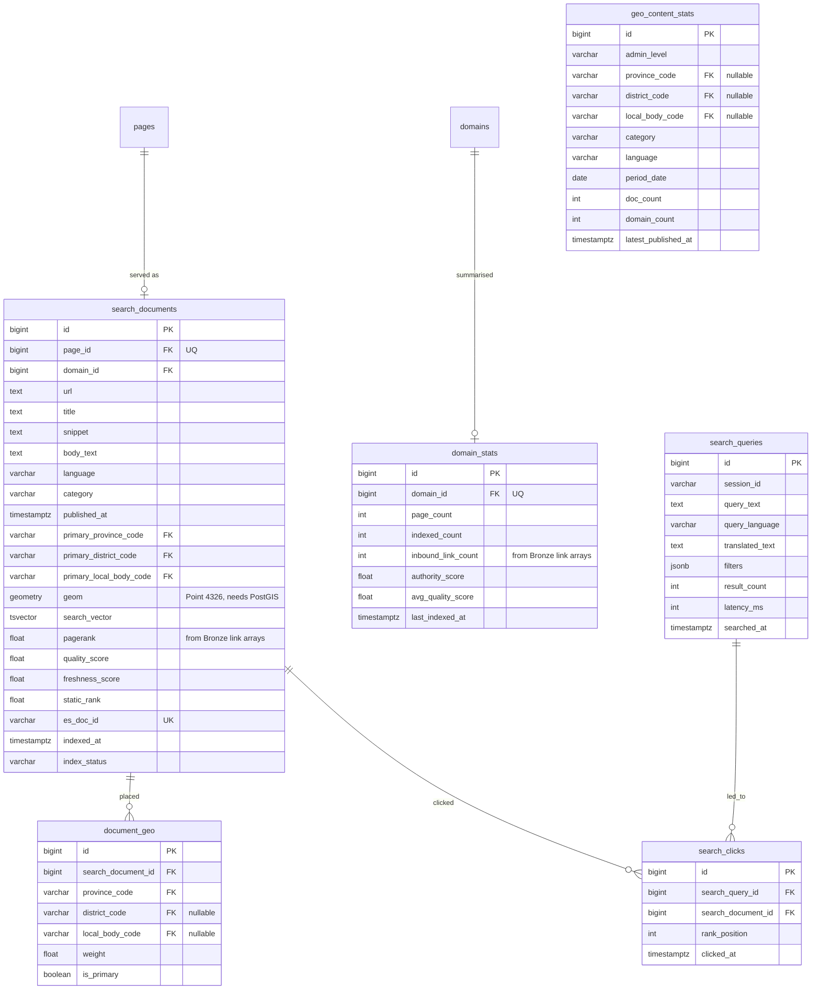

# ER diagram

This file is the source of truth for the schema diagram; GitHub renders the blocks below.
`pgs_search_engine_full_erd.png` is generated from it — after editing, run
`python scripts/render_erd.py` (needs Node) and commit both.

Status per table: **built** = in a migration today · **planned** = agreed, not built yet.
Every table also has `created_at` and `updated_at` (timestamptz, UTC). Enum columns are
`VARCHAR` + `CHECK`, with the values in `src/pgs_db/enums.py`.

## Changes from the original PNG (agreed with the ETL group, 2026-09-26)

| Change | Why |
|---|---|
| `page_links` dropped | Links already live on Bronze (`links`, `internal_links`, `external_links`, `anchor_texts`). PageRank and `domain_stats.inbound_link_count` are computed from those arrays in Spark. |
| `pages.host` dropped | Duplicates `pages.domain_id → domains.domain`; the raw host stays in Bronze. |
| `pages.canonical_url` **kept** | It is the page's identity: the upsert key that makes a recrawl update one page instead of duplicating it, and the URL search results show. The ETL no longer has to send it — `save_page` falls back to the Bronze row's `normalized_url`. |
| `document_embeddings` (Gold) → `page_embeddings` (Silver) | `search_documents` is 1:1 with `pages`, so keying embeddings on the page removes a hop and lets ETL write them before Gold exists. Stored in Postgres with pgvector, 384 dimensions: the search team's query model (`all-MiniLM-L6-v2`) and their `pgvector_search.py` set both. |
| Geo links use **codes**, not ids | `page_geo_tags` references `provinces.code` / `districts.code` / `local_bodies.code`, the codes ETL and search already exchange (`P4`, `D38`, `MUN414`). Gold follows the same rule. |
| A page's source is a crawled page **or** a stored file | `pages.stored_file_id` (CHECK: exactly one of it and `crawled_document_id`) so PDFs and images in MinIO become searchable pages. |
| `entities.type` has no LOCATION | Places are `page_geo_tags` against the gazetteer; a second place list would drift from it. |
| `page_geo_mentions` → `page_geo_tags`, plus `page_contacts` | As built. `page_geo_tags` adds `ward_number`, drops `char_start`/`char_end`. `page_contacts` holds per-page emails, phones and social links. |

## Reference — built

## Bronze — built

## Silver — built

## Gold — planned

Blocked on PostGIS: `search_documents.geom` is `geometry(Point, 4326)`.

