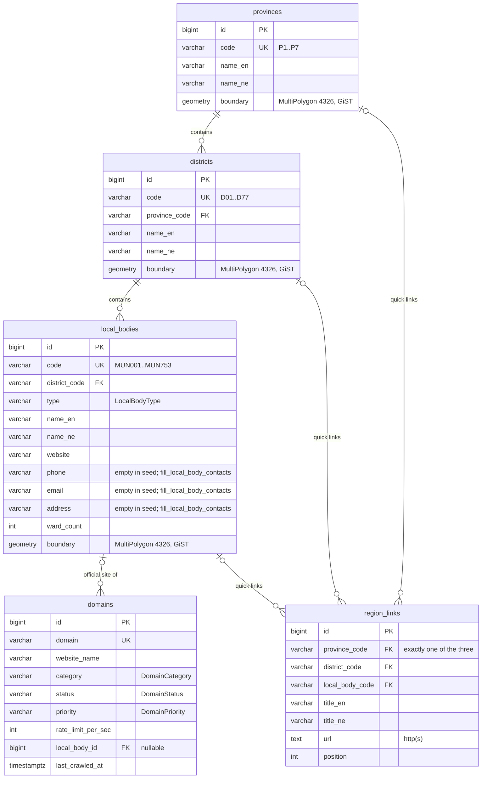
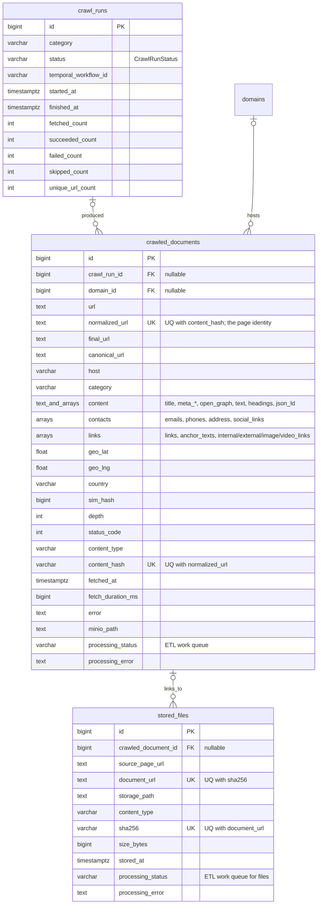
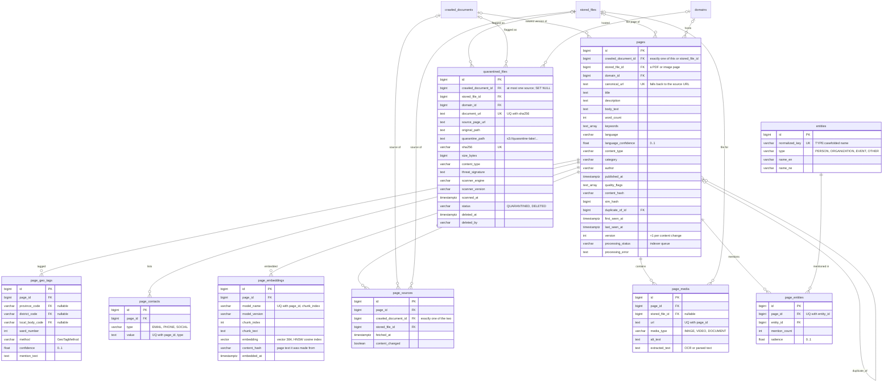
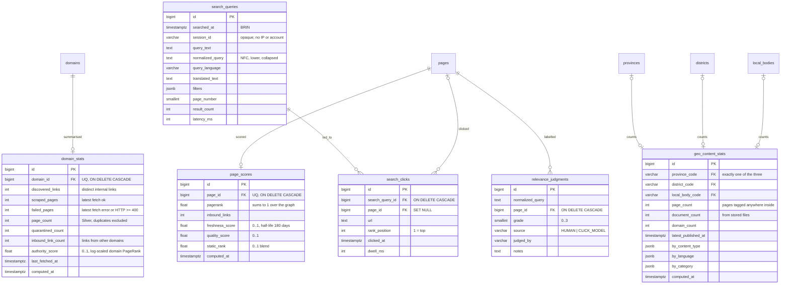
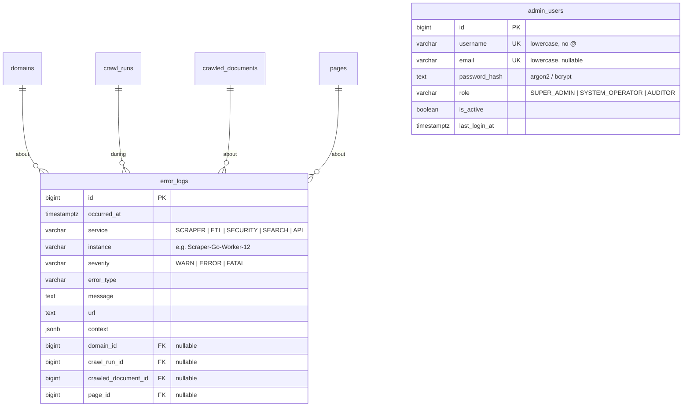

# ER diagram

This file is the source of truth for the schema diagram; GitHub renders the blocks below.
`pgs_search_engine_full_erd.png` is generated from it — after editing, run
`python scripts/render_erd.py` (needs Node) and commit both.

Every table below is **built** (in a migration).
Every table also has `created_at` and `updated_at` (timestamptz, UTC). Enum columns are
`VARCHAR` + `CHECK`, with the values in `src/pgs_db/enums.py`.

## Changes from the original PNG (agreed with the ETL group, 2026-09-26)

| Change | Why |
|---|---|
| `page_links` dropped | Links already live on Bronze (`links`, `internal_links`, `external_links`, `anchor_texts`). PageRank and `domain_stats.inbound_link_count` are computed from those arrays by `RankingRepository.refresh_scores` (see Gold). |
| `pages.host` dropped | Duplicates `pages.domain_id → domains.domain`; the raw host stays in Bronze. |
| `pages.canonical_url` **kept** | It is the page's identity: the upsert key that makes a recrawl update one page instead of duplicating it, and the URL search results show. The ETL no longer has to send it — `save_page` falls back to the Bronze row's `normalized_url`. |
| `document_embeddings` (Gold) → `page_embeddings` (Silver) | `search_documents` is 1:1 with `pages`, so keying embeddings on the page removes a hop and lets ETL write them before Gold exists. Stored in Postgres with pgvector, 384 dimensions: the search team's query model (`all-MiniLM-L6-v2`) and their `pgvector_search.py` set both. |
| Geo links use **codes**, not ids | `page_geo_tags` references `provinces.code` / `districts.code` / `local_bodies.code`, the codes ETL and search already exchange (`P4`, `D38`, `MUN414`). Gold follows the same rule. |
| A page's source is a crawled page **or** a stored file | `pages.stored_file_id` (CHECK: exactly one of it and `crawled_document_id`) so PDFs and images in MinIO become searchable pages. |
| `quarantined_files` in Silver, not Bronze | The ETL scans each payload as it claims it and records ClamAV hits; the Bronze row is parked as `QUARANTINED`. |
| `entities.type` has no LOCATION | Places are `page_geo_tags` against the gazetteer; a second place list would drift from it. |
| `page_geo_mentions` → `page_geo_tags`, plus `page_contacts` | As built. `page_geo_tags` adds `ward_number`, drops `char_start`/`char_end`. `page_contacts` holds per-page emails, phones and social links. |

## Reference — built

Boundaries (migration `c3d4e5f6a7b8`) are Open Knowledge Nepal's CC BY 4.0 shapes, loaded by
`scripts/seed_boundaries.py`; see `data/boundaries/ATTRIBUTION.md`.

```mermaid
erDiagram
    provinces ||--o{ districts : contains
    districts ||--o{ local_bodies : contains
    local_bodies |o--o{ domains : "official site of"
    provinces |o--o{ region_links : "quick links"
    districts |o--o{ region_links : "quick links"
    local_bodies |o--o{ region_links : "quick links"

    provinces {
        bigint id PK
        varchar code UK "P1..P7"
        varchar name_en
        varchar name_ne
        geometry boundary "MultiPolygon 4326, GiST"
    }
    districts {
        bigint id PK
        varchar code UK "D01..D77"
        varchar province_code FK
        varchar name_en
        varchar name_ne
        geometry boundary "MultiPolygon 4326, GiST"
    }
    local_bodies {
        bigint id PK
        varchar code UK "MUN001..MUN753"
        varchar district_code FK
        varchar type "LocalBodyType"
        varchar name_en
        varchar name_ne
        varchar website
        varchar phone "empty in seed; fill_local_body_contacts"
        varchar email "empty in seed; fill_local_body_contacts"
        varchar address "empty in seed; fill_local_body_contacts"
        int ward_count
        geometry boundary "MultiPolygon 4326, GiST"
    }
    region_links {
        bigint id PK
        varchar province_code FK "exactly one of the three"
        varchar district_code FK
        varchar local_body_code FK
        varchar title_en
        varchar title_ne
        text url "http(s)"
        int position
    }
    domains {
        bigint id PK
        varchar domain UK
        varchar website_name
        varchar category "DomainCategory"
        varchar status "DomainStatus"
        varchar priority "DomainPriority"
        int rate_limit_per_sec
        bigint local_body_id FK "nullable"
        timestamptz last_crawled_at
    }
```

## Bronze — built

```mermaid
erDiagram
    crawl_runs |o--o{ crawled_documents : produced
    domains |o--o{ crawled_documents : hosts
    crawled_documents |o--o{ stored_files : links_to

    crawl_runs {
        bigint id PK
        varchar category
        varchar status "CrawlRunStatus"
        varchar temporal_workflow_id
        timestamptz started_at
        timestamptz finished_at
        int fetched_count
        int succeeded_count
        int failed_count
        int skipped_count
        int unique_url_count
    }
    crawled_documents {
        bigint id PK
        bigint crawl_run_id FK "nullable"
        bigint domain_id FK "nullable"
        text url
        text normalized_url UK "UQ with content_hash; the page identity"
        text final_url
        text canonical_url
        varchar host
        varchar category
        text_and_arrays content "title, meta_*, open_graph, text, headings, json_ld"
        arrays contacts "emails, phones, address, social_links"
        arrays links "links, anchor_texts, internal/external/image/video_links"
        float geo_lat
        float geo_lng
        varchar country
        bigint sim_hash
        int depth
        int status_code
        varchar content_type
        varchar content_hash UK "UQ with normalized_url"
        timestamptz fetched_at
        bigint fetch_duration_ms
        text error
        text minio_path
        varchar processing_status "ETL work queue"
        text processing_error
    }
    stored_files {
        bigint id PK
        bigint crawled_document_id FK "nullable"
        text source_page_url
        text document_url UK "UQ with sha256"
        text storage_path
        varchar content_type
        varchar sha256 UK "UQ with document_url"
        bigint size_bytes
        timestamptz stored_at
        varchar processing_status "ETL work queue for files"
        text processing_error
    }
```

## Silver — built

```mermaid
erDiagram
    crawled_documents |o--o{ pages : "newest version of"
    stored_files |o--o{ pages : "file page of"
    domains |o--o{ pages : hosts
    pages |o--o{ pages : duplicate_of
    pages ||--o{ page_geo_tags : tagged
    pages ||--o{ page_contacts : lists
    pages ||--o{ page_embeddings : embedded
    pages ||--o{ page_sources : "fetch history"
    crawled_documents |o--o{ page_sources : "source of"
    stored_files |o--o{ page_sources : "source of"
    pages ||--o{ page_media : contains
    stored_files |o--o{ page_media : "file for"
    pages ||--o{ page_entities : mentions
    entities ||--o{ page_entities : "mentioned in"
    stored_files |o--o{ quarantined_files : "flagged as"
    crawled_documents |o--o{ quarantined_files : "flagged as"
    domains |o--o{ quarantined_files : hosted

    pages {
        bigint id PK
        bigint crawled_document_id FK "exactly one of this or stored_file_id"
        bigint stored_file_id FK "a PDF or image page"
        bigint domain_id FK
        text canonical_url UK "falls back to the source URL"
        text title
        text description
        text body_text
        int word_count
        text_array keywords
        varchar language
        float language_confidence "0..1"
        varchar content_type
        varchar category
        varchar author
        timestamptz published_at
        text_array quality_flags
        varchar content_hash
        bigint sim_hash
        bigint duplicate_of_id FK
        timestamptz first_seen_at
        timestamptz last_seen_at
        int version "+1 per content change"
        varchar processing_status "indexer queue"
        text processing_error
    }
    page_geo_tags {
        bigint id PK
        bigint page_id FK
        varchar province_code FK "nullable"
        varchar district_code FK "nullable"
        varchar local_body_code FK "nullable"
        int ward_number
        varchar method "GeoTagMethod"
        float confidence "0..1"
        text mention_text
    }
    page_contacts {
        bigint id PK
        bigint page_id FK
        varchar type "EMAIL, PHONE, SOCIAL"
        text value "UQ with page_id, type"
    }
    page_embeddings {
        bigint id PK
        bigint page_id FK
        varchar model_name "UQ with page_id, chunk_index"
        varchar model_version
        int chunk_index
        text chunk_text
        vector embedding "vector 384, HNSW cosine index"
        varchar content_hash "page text it was made from"
        timestamptz embedded_at
    }
    page_sources {
        bigint id PK
        bigint page_id FK
        bigint crawled_document_id FK "exactly one of the two"
        bigint stored_file_id FK
        timestamptz fetched_at
        boolean content_changed
    }
    page_media {
        bigint id PK
        bigint page_id FK
        bigint stored_file_id FK "nullable"
        text url "UQ with page_id"
        varchar media_type "IMAGE, VIDEO, DOCUMENT"
        text alt_text
        text extracted_text "OCR or parsed text"
    }
    entities {
        bigint id PK
        varchar normalized_key UK "TYPE:casefolded name"
        varchar type "PERSON, ORGANIZATION, EVENT, OTHER"
        varchar name_en
        varchar name_ne
    }
    page_entities {
        bigint id PK
        bigint page_id FK "UQ with entity_id"
        bigint entity_id FK
        int mention_count
        float salience "0..1"
    }
    quarantined_files {
        bigint id PK
        bigint crawled_document_id FK "at most one source; SET NULL"
        bigint stored_file_id FK
        bigint domain_id FK
        text document_url UK "UQ with sha256"
        text source_page_url
        text original_path
        text quarantine_path "s3://quarantine-lake/..."
        varchar sha256 UK
        bigint size_bytes
        varchar content_type
        text threat_signature
        varchar scanner_engine
        varchar scanner_version
        timestamptz scanned_at
        varchar status "QUARANTINED, DELETED"
        timestamptz deleted_at
        varchar deleted_by
    }
```

## Gold — built

Migrations `8994296d4b0e` (`domain_stats`), `b7c1d2e3f4a5` (search views) and
`d4e5f6a7b8c9` (everything else). The summary tables are rebuilt by
`python -m pgs_db.jobs`; the search log is written by the API.

```mermaid
erDiagram
    domains ||--o| domain_stats : summarised
    pages ||--o| page_scores : scored
    provinces |o--o| geo_content_stats : counts
    districts |o--o| geo_content_stats : counts
    local_bodies |o--o| geo_content_stats : counts
    search_queries ||--o{ search_clicks : led_to
    pages |o--o{ search_clicks : clicked
    pages ||--o{ relevance_judgments : labelled

    domain_stats {
        bigint id PK
        bigint domain_id FK "UQ, ON DELETE CASCADE"
        int discovered_links "distinct internal links"
        int scraped_pages "latest fetch ok"
        int failed_pages "latest fetch error or HTTP >= 400"
        int page_count "Silver, duplicates excluded"
        int quarantined_count
        int inbound_link_count "links from other domains"
        float authority_score "0..1, log-scaled domain PageRank"
        timestamptz last_fetched_at
        timestamptz computed_at
    }
    geo_content_stats {
        bigint id PK
        varchar province_code FK "exactly one of the three"
        varchar district_code FK
        varchar local_body_code FK
        int page_count "pages tagged anywhere inside"
        int document_count "from stored files"
        int domain_count
        timestamptz latest_published_at
        jsonb by_content_type
        jsonb by_language
        jsonb by_category
        timestamptz computed_at
    }
    page_scores {
        bigint id PK
        bigint page_id FK "UQ, ON DELETE CASCADE"
        float pagerank "sums to 1 over the graph"
        int inbound_links
        float freshness_score "0..1, half-life 180 days"
        float quality_score "0..1"
        float static_rank "0..1 blend"
        timestamptz computed_at
    }
    search_queries {
        bigint id PK
        timestamptz searched_at "BRIN"
        varchar session_id "opaque; no IP or account"
        text query_text
        text normalized_query "NFC, lower, collapsed"
        varchar query_language
        text translated_text
        jsonb filters
        smallint page_number
        int result_count
        int latency_ms
    }
    search_clicks {
        bigint id PK
        bigint search_query_id FK "ON DELETE CASCADE"
        bigint page_id FK "SET NULL"
        text url
        int rank_position "1 = top"
        timestamptz clicked_at
        int dwell_ms
    }
    relevance_judgments {
        bigint id PK
        text normalized_query
        bigint page_id FK "ON DELETE CASCADE"
        smallint grade "0..3"
        varchar source "HUMAN | CLICK_MODEL"
        varchar judged_by
        text notes
    }
```

The original design had `page_links` dropped in favour of Spark computing PageRank. It is
computed in `RankingRepository.refresh_scores` instead, straight from Bronze's `links`
arrays (resolved to canonical pages), so no separate job or table is needed; past a few
million pages the power iteration can move to Spark and write the same `page_scores`.

`geo_content_stats` is one row per region (837) with breakdown maps, not the planned
per-category-per-language-per-date grain: the map needs totals per region, and distinct
domain counts cannot be summed across rows.

### Search views

`search_documents` and `document_geo` were planned as tables; they are **views** instead,
because a table would copy `pages` and need a refresh job to stay in step.
`pages.processing_status` is already the indexer's queue, so the planned `index_status` /
`indexed_at` / `es_doc_id` columns are not needed either.

| View | One row per | What it adds |
|---|---|---|
| `page_geo_codes` | geo tag | the full code chain: a tag on `MUN414` also gets `D38` and `P4`, so a district filter finds pages tagged with any of its municipalities |
| `search_documents` | canonical page (duplicates excluded) | domain (from `domains`, or the URL's host), primary location (most confident tag, most specific on a tie), file extension / MIME type / size for stored files, `index_status`, and the ranking signals from `page_scores` / `domain_stats` |

`SearchRepository` reads them: `claim_for_indexing` (the Postgres → OpenSearch queue, in
the search team's `SearchDocument` shape), `documents`, and `vector_search` (best chunk
per page from `page_embeddings`, with geo, language and content-type filters).

## Ops — built

Migration `8994296d4b0e`. `admin_users` is the API's login store (the API hashes passwords;
only the hash is stored). Login takes a username or an email (the UI sends an email), so
usernames may not contain `@`. `error_logs` is written by every service and read by
`GET /api/v1/admin/logs/errors`; its ids are `SET NULL` when retention deletes the subject.

```mermaid
erDiagram
    domains ||--o{ error_logs : about
    crawl_runs ||--o{ error_logs : during
    crawled_documents ||--o{ error_logs : about
    pages ||--o{ error_logs : about

    admin_users {
        bigint id PK
        varchar username UK "lowercase, no @"
        varchar email UK "lowercase, nullable"
        text password_hash "argon2 / bcrypt"
        varchar role "SUPER_ADMIN | SYSTEM_OPERATOR | AUDITOR"
        boolean is_active
        timestamptz last_login_at
    }
    error_logs {
        bigint id PK
        timestamptz occurred_at
        varchar service "SCRAPER | ETL | SECURITY | SEARCH | API"
        varchar instance "e.g. Scraper-Go-Worker-12"
        varchar severity "WARN | ERROR | FATAL"
        varchar error_type
        text message
        text url
        jsonb context
        bigint domain_id FK "nullable"
        bigint crawl_run_id FK "nullable"
        bigint crawled_document_id FK "nullable"
        bigint page_id FK "nullable"
    }
```

## Roles and triggers

Migration `e5f6a7b8c9d0`. Six LOGIN roles, one per service (`pgs_scraper`, `pgs_etl`,
`pgs_search`, `pgs_api`, `pgs_jobs`, `pgs_readonly`), each granted only what it needs; the
matrix is `src/pgs_db/grants.py`. Only `pgs_api` can read `admin_users`. A
`BEFORE UPDATE` trigger (`pgs_set_updated_at`) on every table keeps `updated_at` current for
writers that bypass the ORM.

## Team fit (migration `f6a7b8c9d0e1`)

- **`embedding_models`** (`name` UK, `dimensions` 1..2000, one `is_default`): LaBSE 768
  (default), all-MiniLM-L6-v2 384, paraphrase-multilingual-MiniLM-L12-v2 384.
  `page_embeddings.embedding` is `vector` of any size; its generated `dimensions` column and
  `model_name` form a foreign key to (`name`, `dimensions`). One partial HNSW index per model
  (`ix_page_embeddings_hnsw_<model>`), created by the migration or
  `SilverRepository.register_embedding_model`.
- **`crawl_runs`** gains `seed_count`, `max_depth`, `max_pages`, `domain_capped_count` and
  `error`; a trigger upper-cases `status`, so lower-case writers are accepted.
- **`page_media.context_text`**: an image's surrounding text.

## S3 loader (migration `a7b8c9d0e1f2`)

The scraper now writes S3 instead of Postgres; `pgs_db.ingest` (the `ingest` job) copies its
runs and documents into Bronze. **`bronze_ingest_state`** (`crawl_run_id` UK → `crawl_runs`,
`source`, `last_modified`, `objects_loaded`, `objects_failed`, `finished`, `finished_at`)
remembers how far each run is loaded, so a pass only reads new objects and finished runs are
skipped. Runs keep the scraper's own id (`UnixNano`) as `crawl_runs.id`.
